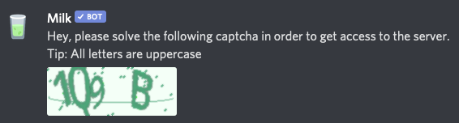

# Verification

In today's world, verification is more important than it ever was. Trying to moderate a server but raids keep spamming the server? Milk's verification system uses captchas to make sure no one can access your servers content after joining.

First of all, let's enable verification. Simply type the command below in a channel Milk has access to:

```text
milk.config verification on
```

### **What does this do?**

1. It creates a role called `Verified` with the permission code[ **104188993**](https://discordapi.com/permissions.html#104188993)\*\*\*\*
2. It adds the verified role to each member in the server.
3. It resets the @everyone permissions to 0.

### **How does this look like?**




**The user will be kicked if they don't complete the captcha.**


## **Commands**


**All commands need to be invoked with the `config verification` group.**


| Name | Description | Example |
| :---: | :---: | :--- |
| on | Enables verification | `milk.config verification on` |
| off | Disables verification | `milk.config verification off` |

